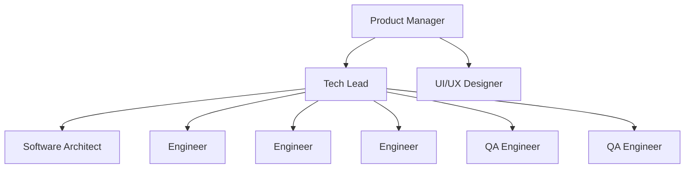
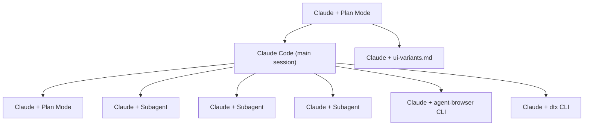

# Team Structure: Traditional vs Claude-Powered

## Traditional Software Team

```mermaid
graph TD
    PM[Product Manager]
    TL[Tech Lead]
    ARCH[Software Architect]
    SE1[Engineer]
    SE2[Engineer]
    SE3[Engineer]
    DES[UI/UX Designer]
    QA1[QA Engineer]
    QA2[QA Engineer]

    PM --> TL
    PM --> DES
    TL --> ARCH
    TL --> SE1
    TL --> SE2
    TL --> SE3
    TL --> QA1
    TL --> QA2
```

## Claude-Powered Team

```mermaid
graph TD
    PM["Claude + Plan Mode"]
    TL["Claude Code (main session)"]
    ARCH["Claude + Plan Mode"]
    SE1["Claude + Subagent"]
    SE2["Claude + Subagent"]
    SE3["Claude + Subagent"]
    DES["Claude + ui-variants.md"]
    QA1["Claude + agent-browser CLI"]
    QA2["Claude + dtx CLI"]

    PM --> TL
    PM --> DES
    TL --> ARCH
    TL --> SE1
    TL --> SE2
    TL --> SE3
    TL --> QA1
    TL --> QA2
```
