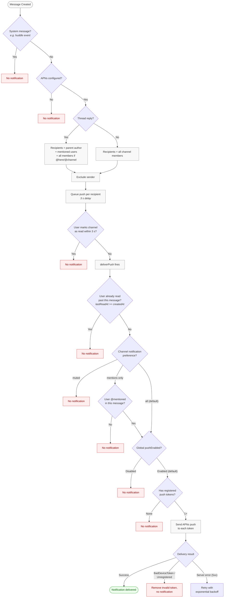

# Notification Flow

How the system decides whether to send a push notification for a new message.

```mermaid
flowchart TD
    start([Message Created]) --> sysMsg{System message?<br/><i>e.g. huddle event</i>}
    sysMsg -- Yes --> noSys[No notification]
    sysMsg -- No --> apns{APNs configured?}
    apns -- No --> noApns[No notification]
    apns -- Yes --> msgType{Thread reply?}

    %% --- Recipient selection ---
    msgType -- Yes --> threadRecip[Recipients = parent author<br/>+ mentioned users<br/>+ all members if @here/@channel]
    msgType -- No --> chanRecip[Recipients = all channel members]
    threadRecip --> excludeSender[Exclude sender]
    chanRecip --> excludeSender

    excludeSender --> queue[Queue push per recipient<br/><i>3 s delay</i>]
    queue --> cancelCheck{User marks channel<br/>as read within 3 s?}
    cancelCheck -- Yes --> noCancelled[No notification]
    cancelCheck -- No --> deliver[deliverPush fires]

    %% --- Delivery checks ---
    deliver --> readPos{User already read<br/>past this message?<br/><i>lastReadAt >= createdAt</i>}
    readPos -- Yes --> noRead[No notification]
    readPos -- No --> chanPref{Channel notification<br/>preference?}

    chanPref -- "muted" --> noMuted[No notification]
    chanPref -- "mentions only" --> mentioned{User @mentioned<br/>in this message?}
    mentioned -- No --> noMention[No notification]
    mentioned -- Yes --> globalPref
    chanPref -- "all (default)" --> globalPref{Global pushEnabled?}

    globalPref -- Disabled --> noGlobal[No notification]
    globalPref -- "Enabled (default)" --> tokens{Has registered<br/>push tokens?}

    tokens -- None --> noTokens[No notification]
    tokens -- "1+" --> send[Send APNs push<br/>to each token]

    send --> result{Delivery result}
    result -- Success --> yes([Notification delivered])
    result -- "BadDeviceToken /<br/>Unregistered" --> cleanup[Remove invalid token,<br/>no notification]
    result -- "Server error (5xx)" --> retry[Retry with<br/>exponential backoff]

    %% --- Styling ---
    classDef no fill:#fee,stroke:#c33,color:#900
    classDef yes fill:#efe,stroke:#3a3,color:#060
    classDef neutral fill:#f8f8f8,stroke:#888

    class noSys,noApns,noCancelled,noRead,noMuted,noMention,noGlobal,noTokens,cleanup no
    class yes yes
    class start,queue,deliver,threadRecip,chanRecip,excludeSender,send neutral
```
